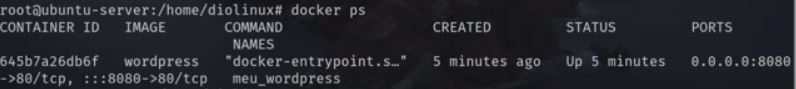
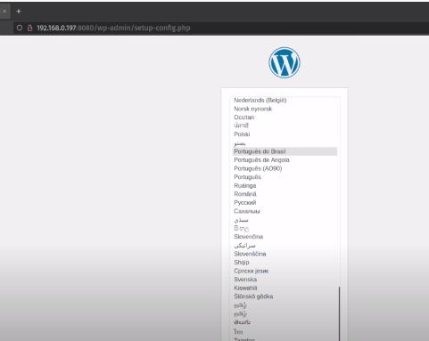

Docker - é usado para se referir tanto a uma empresa (Docker) quanto a ferramenta (Docker) - na maioria das vezes que estiver se referindo a Docker é para falar da ferramenta.

Como fazer um ambiente propício tanto para desenvolvimento quanto produção para que todas as pessoas do squad conseguisem rodar o mesmo ambiente (evitando catástrofes).

Antigamente fazia isso atréz de VM (máquinas virtuais)

Docker e Ubunto Server (06/2022)

### instalar:

```
sudo apt install docker.io docker-compose
```

docker.io - básico para rodar o docker

docker-compose - usado para subir container usando o docker files.


### fazer o docker iniciar junto com o sistema e habilitar seu uso sem reiniciar o servidor

```
sudo systemctl enable --new docker docker.socket containerd
```
### help

```
docker --help
```

https://hub.docker.com/ - repositório comunitário com imagens de várias aplicações e sistemas operacionais em containers.


## Mini-tutorial

Criar uma instancia local de wordPress

1 - Logar como root (Linux)
```
sudo su
```
2 - Baixar uma imagem do WordPress do DockerHub (se você não expecificar uma versão o comando vai tentar baixar a ultima imagem
```
docker pull wordpress
```
(OBS: O que você baixou aqui é uma Imagem wordpress em docker. A imagem é uma forma (uma base) que é usada para criar vários servidores dockers diferentes com mesma configuração)

3 - O comando docker images é possível ver as imagens disponíveis
```
docker images
```


IMAGE ID - id único da imagem
SIZE - tamanho

4 - Um container é uma imagem em execução. E para criar um container baseado em uma imagem. Roda um comando:

```
docker run --name meuwordpress -p 8080:80 -d wordpress
```

docker run -> comando para rodar o container

--name **meu_wordpress** -> expecifica um nome para o container

-p **8080:80** -> expecifica uma porta para o serviço rodar

-d **wordpress** -> expecifica qual é a imagem que vai rodar atravéz dessa porta

depois que você fez isso o container já está rodando

5 - Esse comando lista os containers em execução

```
docker ps
```

 

CONTAINER ID -> lista os IDs dos containers em execução
PORTS -> a porta que o servidor está usando (se você digitar o endereço de ip do browser você vai poder acessar uma instancia do container - nesse caso é wordpress)



## Remover Container

1 - Listar os containers que estão rodando
```
docker ps -a
```
-a -> mostra todos os containers que estão rodando e parados.


OBS: Os containers que estão rodando estão com estado de UP. Os que existem mas não estão rodando ficam com estado diferente.

2 - Containers que estão rodando não podem ser removidos. Você precisa parar eles primeiro

```
docker stop ID_DO_CONTAINER
```
OBS:
Inicia o container
```
docker start ID_DO_CONTAINER
```
Reinicia o container
```
docker restart ID_DO_CONTAINER
```

3 - para remover um container você usa o comando:
```
docker rm ID_DO_CONTAINER
```
obs: mas as imágens continuam no computador. Para remover as imagens usa o comando:
```
docker rmi ID_DA_IMAGEM
```
obs: Se algum container estiver usando a imagem. Você vai precisar remover o contaneir primeiro antes de remover a imagem. Você pode até forçar a remoção da imagem com um container em execução mas isso pode causar alguns problemas. 


### OBS: Criando o ubunto service

- baixando a image do ubunto 
docker pull ubunto


- criando um container
docker run -it ubuntu

================================

```
configurando o windows

- WSL 2 - AMbiente linux e todos seus benefícios
- windows terminal
- docker desktop
```


Fontes:
https://www.youtube.com/watch?v=BICy_5hXWWs&t=8629s
